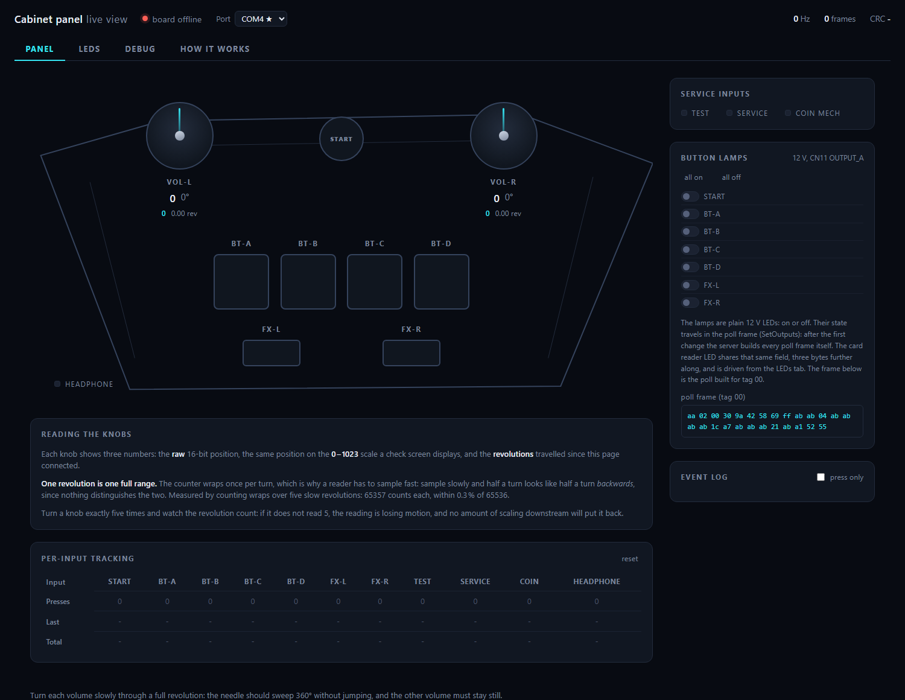
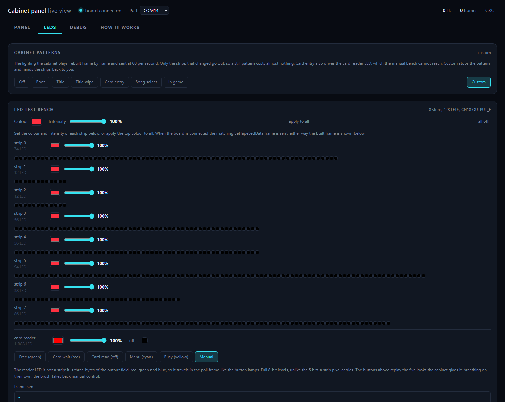
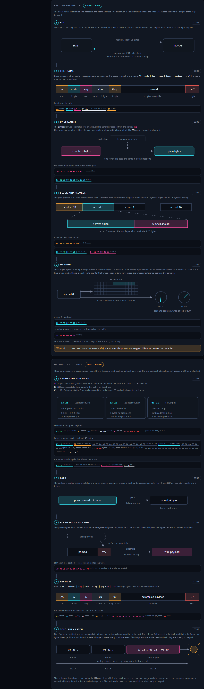

# bi2x-lab

This project reads the inputs of an arcade rhythm-game control panel, and drives its outputs. The
inputs are the buttons, the service switches and the two 360-degree volume knobs. The outputs are
the button lamps and the LED strips. The project talks to the cabinet I/O board over the USB serial
link. No vendor library is necessary.

The board uses a framed protocol with a per-packet obfuscation layer. This repository documents the
protocol. It also has a decoder and an encoder with few dependencies.

Status:

- The inputs are fully decoded and tested on hardware.
- The outputs are decoded, driven and tested on hardware: the LED strips, the button lamps, the
  card reader LED, and the cabinet's own lighting patterns, which the panel replays and which look
  like the ones it plays itself. The outbound frame format is reversed and `bi2x/encoder.py` builds
  the frames (see [docs/OUTPUTS.md](docs/OUTPUTS.md)).

The project validated the decoder on 10502 captured frames against a timestamped state log. 100% of
the payloads are the same byte for byte. 100% of the button states are correct. The header CRC is
correct on every frame of four separate captures. The outbound codec round-trips against the vendor
library on 500 of 500 random payloads.

For the protocol, the connectors and the signal map, see [docs/TECHNICAL.md](docs/TECHNICAL.md).

## What it decodes

| Signal | Notes |
|---|---|
| START, BT-A to BT-D, FX-L, FX-R | 7 buttons, active low |
| VOL-L / VOL-R | 12-bit absolute encoders, they wrap, expanded to 16 bits |
| TEST / SERVICE / COIN MECH | service panel |
| HEADPHONE | jack detection |
| 56-bit input field, 4 analog channels | this cabinet wires only 7 bits and 2 channels |

## What it drives

| Output | Notes |
|---|---|
| 8 LED strips, 428 LEDs | pixel commands plus a latch, without which nothing shows |
| 7 button lamps | on or off, inside the poll frame |
| card reader LED | RGB, 8 bits a channel, inside the poll frame too |
| the cabinet's lighting patterns | rebuilt in `bi2x/patterns.py`, played at 60 frames a second |

## Run the tools

The decoder has no dependencies. It works offline on a captured stream. The live tools need
`pyserial`.

```
pip install pyserial
python bi2x/panel.py            # then open http://127.0.0.1:8740
python bi2x/client.py           # console output
```

The serial port is exclusive. Close all other programs that use the board first.

The tools initialize the board only when it is freshly powered: a board that already answers polls
is picked up as-is, without the startup handshake. See
[docs/COMMUNICATION.md](docs/COMMUNICATION.md).

The panel opens on the live view of the inputs. The shots below were taken with no board attached,
which is why every reading sits at zero.



The LEDs tab drives the outputs: the cabinet's own lighting patterns, a colour and an intensity per
strip, and the card reader LED.



The How it works tab is a walk through the protocol itself, from the poll to the latch, with the
bytes of a real frame at every step.



The live tools send request frames to poll the board. The request payload is compressed; that
compression is now implemented in `bi2x/encoder.py`, but the tools still replay recorded requests
from `bi2x/replay.json` by default, since they are known good. This project does not distribute that
file. Make your own from a capture of your cabinet, see [docs/CAPTURE.md](docs/CAPTURE.md). The
decoder does not need this file. It decodes any stream that you already have.

For how the poll works and what `replay.json` holds, see
[docs/COMMUNICATION.md](docs/COMMUNICATION.md).

## Layout

```
bi2x/decoder.py   framing, CRCs, deobfuscation, block and record access
bi2x/encoder.py   the mirror of the decoder: builds outbound frames (lamps, LED strips)
bi2x/patterns.py  the cabinet's own lighting patterns, rebuilt frame by frame
bi2x/client.py    console client, shows the inputs live
bi2x/panel.py     local web server: inputs, LED and lamp control, and a frame debug view
bi2x/web/         the panel page (HTML, CSS, JS, no build step, no CDN)
```

## License

MIT. See [LICENSE](LICENSE). The license is permissive on purpose. The point of this work is that
other people can reuse it.
